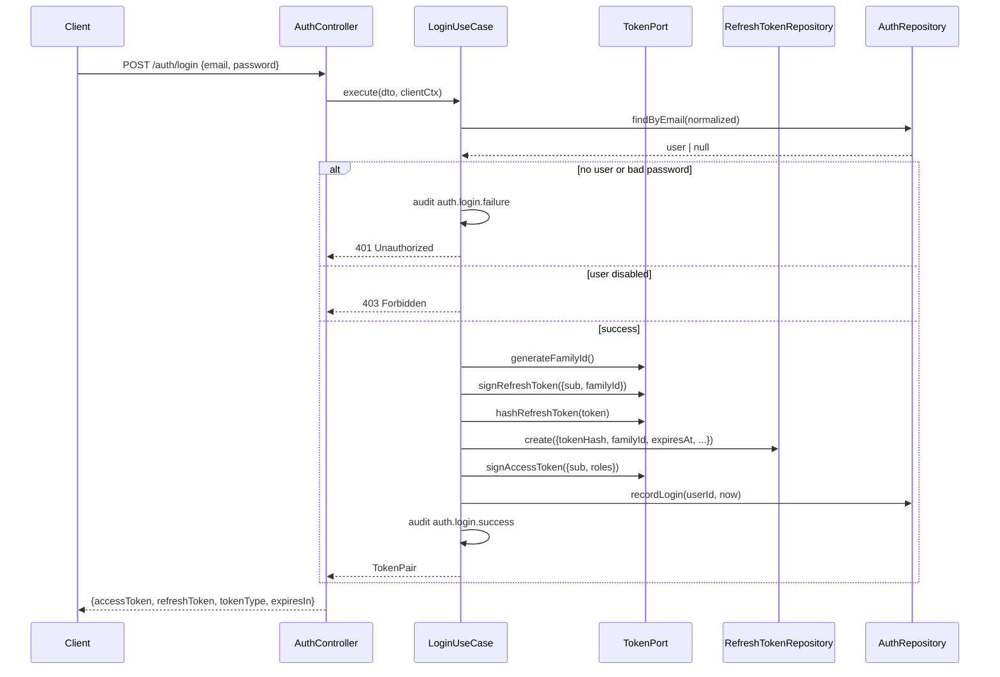
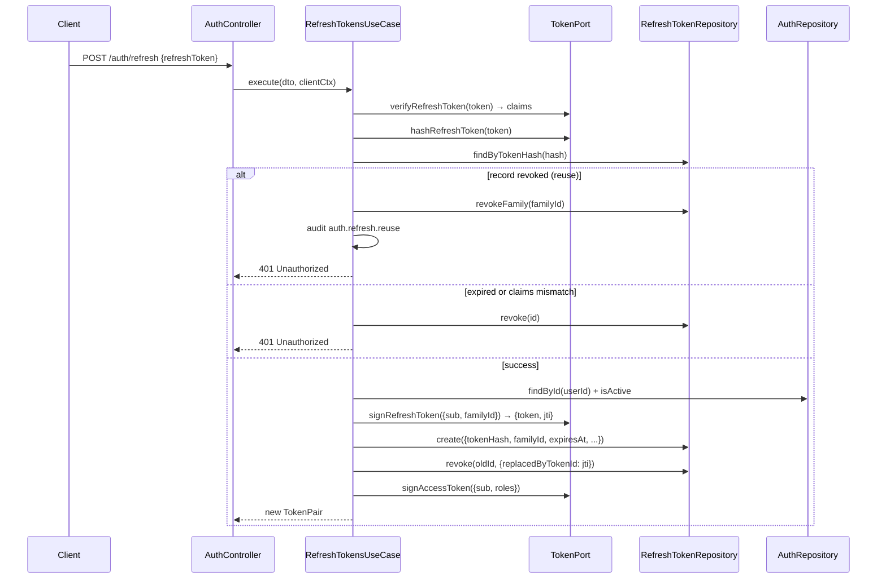
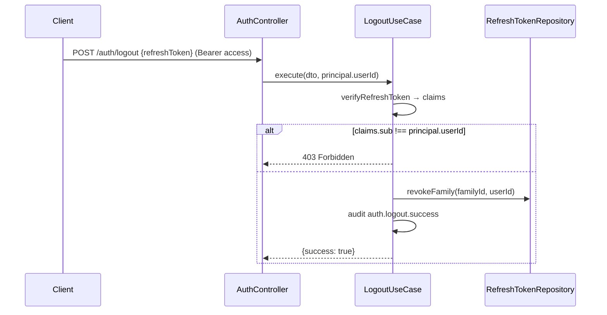

# Phase 1 — Authentication Report

- **Phase**: 1 (Backend: stateless JWT authentication + RBAC)
- **Repo**: `digital-wave-sales-intelligence`
- **Branch**: `main`
- **Commit**: see "Commit SHA" below
- **Date**: 2026-08-07
- **Status**: complete — build, lint, and all tests green; full flow verified live against the local database

---

## 1. Objective

Deliver a production-grade authentication foundation:

- Stateless **access** tokens (JWT, 15 min) + **refresh** tokens (JWT, 30 d) with rotation
- **Argon2id** password hashing
- **RBAC** with system roles `ADMIN` / `MEMBER` / `GUEST`
- Global **opt-out** `AuthGuard` (routes are secured by default; `@Public()` opts out)
- Swagger UI docs at `/docs`
- Unit tests + live end-to-end verification

---

## 2. Architecture

The auth feature follows the existing hexagonal layout (`domain` / `application` / `infrastructure` / `presentation`) with port symbols injected via DI.

```
┌──────────────────────────── presentation ────────────────────────────┐
│ AuthController   AuthGuard   RolesGuard   DTOs (class-validator)     │
└───────────────────────────────┬──────────────────────────────────────┘
                                │ use cases
┌────────────────────────── application ───────────────────────────────┐
│ RegisterUserUseCase  LoginUseCase  RefreshTokensUseCase              │
│ LogoutUseCase  GetMeUseCase  user-profile.mapper                     │
└───────┬──────────────────────┬───────────────────────┬───────────────┘
        │ ports (symbols)      │                       │
┌───────▼───────────┐ ┌────────▼──────────┐ ┌──────────▼─────────────┐
│ infrastructure    │ │ infrastructure    │ │ infrastructure         │
│ adapters          │ │ repositories      │ │ adapters               │
│ JwtTokenAdapter   │ │ PrismaAuthRepo    │ │ Argon2PasswordHasher   │
│ PrismaAuditAdapter│ │ PrismaRefreshRepo │ │ PrismaAuditAdapter     │
└───────────────────┘ └───────────────────┘ └────────────────────────┘
```

**Ports** (`domain/ports/`, DI symbols):
- `TokenPort` — sign/verify access & refresh tokens, sha256-hash refresh tokens, `familyId` generation, TTL getters
- `PasswordHasherPort` — `hash` / `verify`
- `AuthRepository` — email/id lookup, transactional `createUserWithRole`, system-role resolution, `recordLogin`
- `RefreshTokenRepository` — create / `findByTokenHash` / `revoke` (with `replacedByTokenId`) / `revokeFamily`
- `AuditPort` — structured audit events (success/failure/reuse)

**Adapters**:
- `JwtTokenAdapter` — `@nestjs/jwt` (HS256), separate access/refresh secrets, algorithm pinned on verify, refresh tokens hashed with sha256 before persistence
- `Argon2PasswordHasher` — Argon2id
- `PrismaAuditAdapter` — logs audit events via `EventLogger` + `RequestContextService`
- `PrismaAuthRepository` / `PrismaRefreshTokenRepository` — Prisma 7 driver-adapter client (composition pattern)

**Guards** (global, registered in `AppModule`):
1. `ThrottlerGuard` (default 100/min; auth endpoints additionally 10/min)
2. `AuthGuard` — honors `@Public()`; otherwise parses `Bearer`, verifies, attaches `AuthPrincipal` to `request[AUTH_PRINCIPAL_KEY]`
3. `RolesGuard` — enforces `@Roles(...)`; denied when the principal lacks a required role

---

## 3. Sequence Diagrams

### Login


### Refresh (rotation)


### Logout


---

## 4. Data Model Changes

Migration `20260806051419_add_password_hash_and_refresh_tokens`:

- `User.passwordHash VARCHAR(255) NOT NULL` (map `password_hash`)
- `RefreshToken` (table `refresh_tokens`):
  - `id UUID PK`
  - `userId FK → user(id) ON DELETE CASCADE`
  - `tokenHash VARCHAR(255)` — **unique** (`uq_refresh_tokens_token_hash`)
  - `familyId VARCHAR(64)` — rotation lineage
  - `replacedByTokenId VARCHAR(64)` — `jti` of the successor token
  - `expiresAt TIMESTAMPTZ`, `revokedAt TIMESTAMPTZ NULL`
  - `userAgent VARCHAR(512)`, `ipAddress VARCHAR(64)`
  - `createdById` / `updatedById` FK → `user(id)`
  - `createdAt` / `updatedAt`
  - Indexes on `userId`, `familyId`, `expiresAt`, `createdById`, `updatedById`
- **No soft delete** on `refresh_tokens`: ephemeral security data; rotation history is preserved via `familyId` + `replacedByTokenId`, and hard delete is permitted by `DATABASE_RULES`.

**Seed** (`prisma/seed.ts`, wired into `prisma.config.ts`): upserts SYSTEM roles `ADMIN`, `MEMBER`, `GUEST` (kind `SYSTEM`, status `ACTIVE`). Required before registration (`register` fails 503 if the `GUEST` role is missing).

---

## 5. Configuration (`.env`)

| Variable | Default | Notes |
|---|---|---|
| `JWT_SECRET` / `JWT_REFRESH_SECRET` | — | required, min 32 chars, distinct |
| `JWT_ACCESS_TTL` | 900 | seconds (1–86400) |
| `JWT_REFRESH_TTL` | 2592000 | seconds (60–31536000) |
| `JWT_ALGORITHM` | HS256 | HS256/HS384/HS512 |
| `AUTH_THROTTLE_TTL_SECONDS` | 60 | seconds |
| `AUTH_THROTTLE_LIMIT` | 10 | requests per window for auth routes |
| `THROTTLE_TTL_SECONDS` / `THROTTLE_LIMIT` | 60 / 100 | global default throttler |

`.env` holds generated 64-char base64url secrets and is gitignored. `.env.example` uses `REPLACE_WITH_...` placeholders.

---

## 6. Endpoints

Global prefix `api/v1`; docs at `/docs` (Swagger UI, `addBearerAuth`).

| Method | Path | Auth | Success | Notes |
|---|---|---|---|---|
| POST | `/auth/register` | public | 201 `UserResponseDto` | default role `GUEST`; conflict → 409 |
| POST | `/auth/login` | public | 200 `TokenResponseDto` | 401 on bad creds, 403 if disabled |
| POST | `/auth/refresh` | public | 200 `TokenResponseDto` | rotates; reuse → revoke family + 401 |
| POST | `/auth/logout` | Bearer | 200 `{success:true}` | revokes presented token's family; cross-user → 403 |
| GET | `/auth/me` | Bearer | 200 `UserResponseDto` | skips the `auth` throttle (see §8 concerns) |
| GET | `/health` | public | 200 | skips both throttlers |

Response envelopes: success `{"data": ...}`, error `{"error": {"code", "message", "details"}}` (existing `AllExceptionsFilter` / `TransformInterceptor`).

---

## 7. Tests

`npm test` — **65 passing / 0 failing** (Node `node:test` + `tsx`).

New auth specs (41):
- `login.usecase.spec.ts` (7) — success, email normalization, unknown email, wrong password, disabled account, token record shape, last-login
- `refresh-tokens.usecase.spec.ts` (6) — rotation + lineage, reuse → family revoke, expiry, claims mismatch, inactive account, unknown hash
- `logout.usecase.spec.ts` (3) — family revoke, no record, cross-user forbidden
- `register-user.usecase.spec.ts` (3) — GUEST default, normalization, duplicate conflict
- `get-me.usecase.spec.ts` (2)
- `jwt-token.adapter.spec.ts` (7) — round-trips, wrong secret, type cross-verification, tampering, deterministic hashing, unique family ids
- `argon2-password-hasher.adapter.spec.ts` (4)
- `auth.guard.spec.ts` (5) — public bypass, missing/malformed header, principal attachment, verification failure
- `roles.guard.spec.ts` (4)

Pre-existing (24, incl. rewritten `env.validation.spec.ts` with JWT/throttle cases).

**Live verification** (against local Prisma Postgres): register → duplicate → login → `/me` → refresh rotation → reuse detection + family revoke → logout → cross-user logout 403 → Swagger 200 → throttle 429 after 10.

**Bugs found and fixed during testing:**
1. `jsonwebtoken` rejects a payload `jti` combined with the `jwtid` sign option ("Bad options.jwtid") — refresh signing now uses `jwtid` only.
2. `@nestjs/throttler` `ttl` is **milliseconds**; the config supplied seconds, so the `auth` throttler never fired. Wiring now multiplies by 1000.

---

## 8. Security Review

**Implemented**
- Argon2id password hashing (memory/time-tuned defaults)
- Refresh tokens stored **hashed** (sha256) — raw token never persisted; lookups by hash
- Refresh **rotation** with `familyId` lineage and `replacedByTokenId` (jti); reusing a revoked token revokes the entire family
- Distinct access/refresh secrets (min 32 chars); algorithm pinned on verify (prevents algorithm-confusion)
- Access TTL 15 min (short window limits stateless-token exposure); refresh 30 d
- Global security defaults: Helmet, CORS restricted to configured origins, global guards on by default
- Uniform error codes; login failure is indistinguishable for unknown email vs bad password; disabled account → 403
- Validation: `whitelist` + `forbidNonWhitelisted` via class-validator DTOs
- Rate limiting: global 100/min + auth 10/min per IP+route
- Audit events: `auth.login.failure/success`, `auth.refresh.success/reuse`, `auth.logout.success`, `auth.register.success`
- Secrets not committed; `.env` gitignored (verified via `git check-ignore`)

**Accepted trade-offs / concerns**
- Access tokens are self-contained → not individually revocable until expiry; revocation is scoped to the refresh family (standard stateless-JWT trade-off)
- `register` 409 reveals email existence (accepted for UX; add email verification for hardening)
- Throttling is per IP+route, not per account → distributed brute force remains; consider per-account counters/adaptive limits in a later phase
- `req.ip` tracking assumes no reverse proxy; `app.set('trust proxy', ...)` needed behind a proxy
- Login throttle also applies to `POST /auth/*` routes (except `GET /auth/me`, which opts out of the auth throttler)
- No password reset, email verification, or refresh-token "remember me" distinction yet (future phases)
- `password_hash NOT NULL` migration only succeeds on an empty `users` table — deployment to a populated DB needs a backfill strategy
- `npm audit` reports 2 high-severity transitive findings (unaddressed)

**Architecture notes**
- Prisma 7: `class extends PrismaClient` degrades nested-select generics; `PrismaService` now composes a `readonly client` instead
- `@nestjs/swagger` v11 bundles its own UI; `swagger-ui-express` is not needed

---

## 9. Files

**New — auth module** (`backend/src/modules/auth/`)
- `domain/value-objects/system-role.enum.ts`
- `domain/entities/{user-account,token-pair,refresh-token-record}.entity.ts`
- `domain/ports/{token,password-hasher,auth.repository,refresh-token.repository,audit}.port.ts`
- `application/user-profile.mapper.ts`
- `application/use-cases/{register-user,login,refresh-tokens,logout,get-me}.usecase.ts` (+ `.spec.ts`)
- `infrastructure/adapters/{jwt-token,argon2-password-hasher,prisma-audit}.adapter.ts`
- `infrastructure/adapters/{jwt-token,argon2-password-hasher}.adapter.spec.ts`
- `infrastructure/repositories/{prisma-auth,prisma-refresh-token}.repository.ts`
- `presentation/controllers/auth.controller.ts`
- `presentation/guards/{auth,roles}.guard.ts` (+ `.spec.ts`)
- `presentation/dto/{register,login,refresh,logout,auth-response}.dto.ts`
- `auth.module.ts`

**New — common** (`backend/src/common/`)
- `constants/auth.constants.ts`
- `interfaces/auth-principal.interface.ts`
- `decorators/{public,roles,current-user}.decorator.ts`

**New — database**
- `prisma/migrations/20260806051419_add_password_hash_and_refresh_tokens/migration.sql`
- `prisma/seed.ts`

**Modified**
- `backend/src/app.module.ts` (two named throttlers + 3 global guards + AuthModule)
- `backend/src/main.ts` (Swagger `/docs`)
- `backend/src/database/prisma/prisma.service.ts` (composition refactor)
- `backend/src/modules/health/{application/health.service.ts, presentation/health.controller.ts}`
- `backend/src/config/{configuration.ts, env.validation.ts, env.validation.spec.ts}`
- `prisma/schema.prisma`, `prisma.config.ts`
- `.env` (gitignored), `.env.example`
- `package.json` / `package-lock.json` (`@nestjs/jwt`, `argon2`, `@nestjs/swagger`; removed `swagger-ui-express`)

---

## 10. Commit SHA

Feature commit: `fcfadc2c8b5162a60fb25080df0daa980e49310e` (see `git log`).
